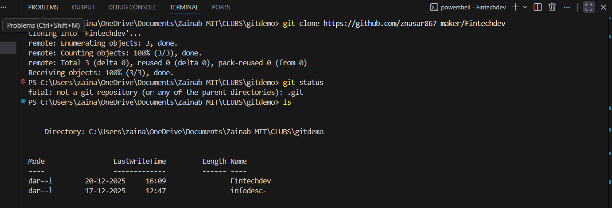
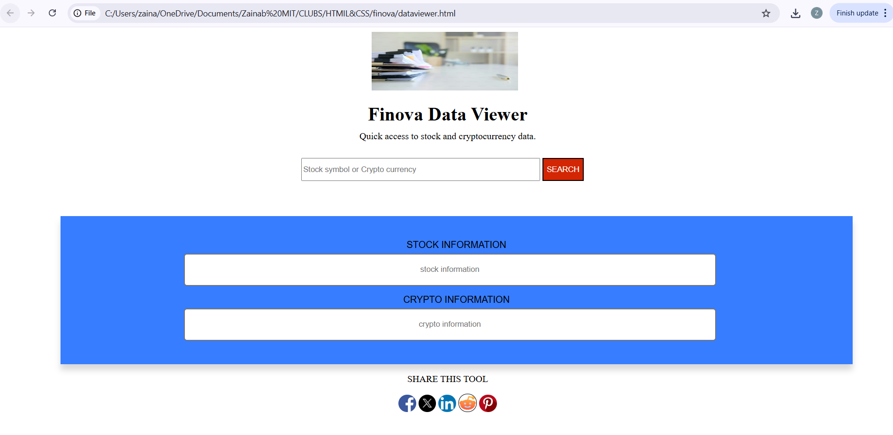

# Finnova data viewer

## 1.Client -Server model

### What is a Client?
A client is the part of an application that the user interacts.
Ex: Website, mobile app etc.

### What is a Server?
A server is a system that recieves the request from client , process them and gives response.
Ex: google.com 

### How do they communicate?
The client and server communicate via the internet using a request–response mechanism, where the client sends a request, the server processes it, and the server returns the appropriate data to the client.

### What happens when a user clicks search?
1. The user enters a stock symbol or crypto name in the input field.
2. The client sends this input to the server as a request.
3. The server receives the request and identifies whether it is a stock or crypto.
4. The server fetches the required data.
5. The server sends the data back to the client.
6. The client displays the data in the appropriate section.

## 2.How full-stack applications work

### Frontend
, the frontend is the visible part of the application that users interact with, responsible for presenting information on the screen, collecting user input, and communicating with the backend to fetch or send data.
it includes HTML,CSS and JavaSccript.

### Backend
the backend handles the application’s core functionality behind the scenes, managing requests from the frontend, processing data, interacting with databases or external services, and returning the appropriate responses to the user interface.

### Database
the database is a storage system that securely saves data for long-term use, allowing the application to store, retrieve, and manage information such as stock details, cryptocurrency data, and user-related records whenever needed.

### API
APIs act as a bridge that enables different applications to exchange data.In this project, APIs would be used to fetch stock or cryptocurrency data from external sources.

### How these layers talk to each other
1. The frontend sends a request to the backend.
2. The backend processes the request.
3. The backend fetches data from the database or   APIs.
4. The backend sends the result back to the frontend.
5. The frontend displays the result to the user.

## Screenshot

## UI in the browser

